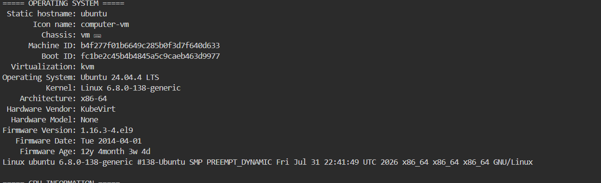
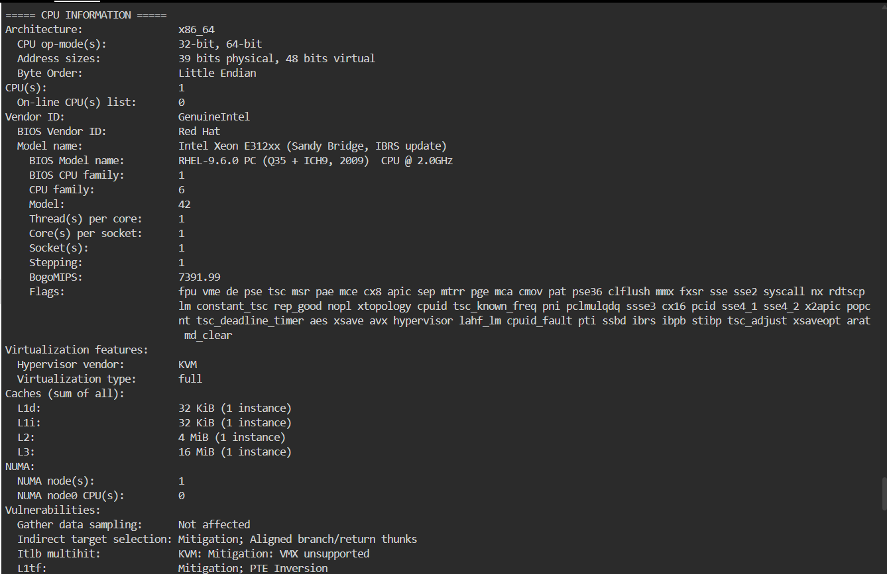
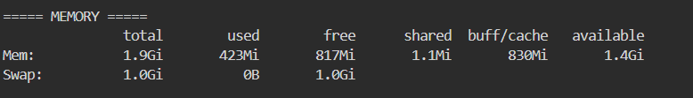
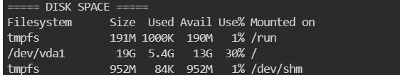

# Laboratory 3 – Multi-Cloud Explorer

Cloud Evaluation Team mission for CloudNova Technologies: researching AWS, Azure, and GCP, comparing their services, and recommending suitable cloud platforms for different client scenarios.

## Contents

- `aws-research.md` – AWS overview and core services
- `azure-research.md` – Azure overview and core services
- `gcp-research.md` – GCP overview and core services
- `cloud-platform-comparison.md` – Cloud platform comparison and service-matching tables
- `client-recommendations.md` – Recommendations for Clients A–D and decision matrix
- `reflection.md` – Mission reflection
- `screenshots/` – Evidence and screenshots for each checkpoint

## Checkpoint 7 – Linux Investigation

### System Information

**Operating System:** Ubuntu 24.04.4 LTS, Kernel 6.8.0-138-generic, x86_64 architecture, running as a KVM virtual machine.

**CPU:** 1 vCPU, Intel Xeon E312xx (Sandy Bridge), x86_64 architecture, 1 socket / 1 core / 1 thread, with 16 MiB L3 cache.

**Memory:** 1.9 GiB total RAM, 817 MiB free, 1.4 GiB available, and 1.0 GiB swap.

**Disk Space:** 19 GB total on the root filesystem (`/dev/vda1`), 5.4 GB used, and 13 GB available, with approximately 30% of the disk space currently used.

### If this Linux server were migrated to the cloud, which AWS, Azure, and GCP services could host it?

Given the small footprint of this Linux server, with 1 vCPU, approximately 2 GB of RAM, and 19 GB of disk space, it can be hosted using small general-purpose virtual machine instances from AWS, Azure, or GCP.

- **AWS:** Amazon EC2 using a `t3.micro` or `t3.small` instance, depending on the required memory and workload. The server's root disk can be stored using Amazon EBS with a General Purpose SSD volume of approximately 20 GB.
- **Azure:** Azure Virtual Machines using a `B1s` or `B1ms` burstable VM size. The operating system disk can be stored using an Azure Managed Disk with approximately 20 GB of storage.
- **GCP:** Google Compute Engine using an `e2-micro` or `e2-small` machine type. A Persistent Disk of approximately 20 GB can be used for the server's operating system and files.

### Personal Choice

I would personally choose **AWS EC2** for this Linux server because it provides flexible instance options and allows the server resources to be adjusted as the workload changes. EC2 can also be combined with Amazon EBS for persistent storage, making it suitable for hosting a small Linux server. Since I also researched AWS extensively in this laboratory, using EC2 would give me an opportunity to apply what I learned about AWS services in a practical cloud environment.

### Terminal Evidence

**Operating System Check:**

**CPU Information:**

**Memory Information:**

**Disk Space:**

