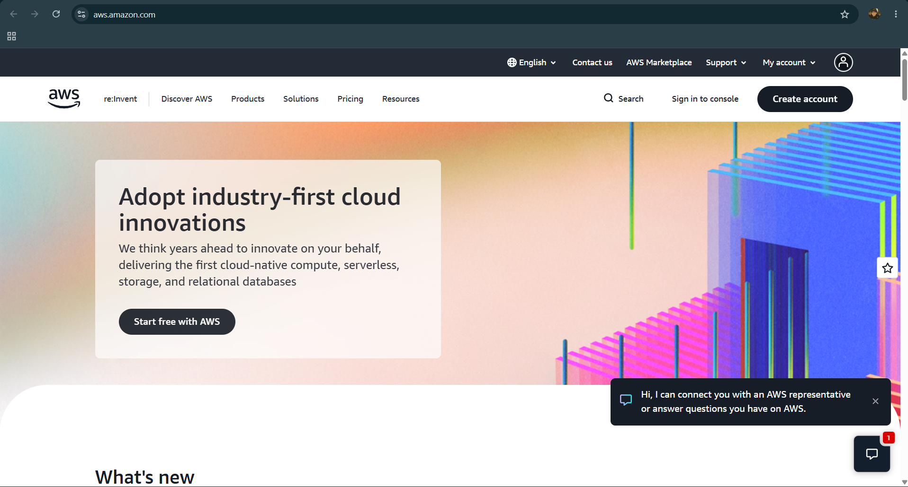

# Amazon Web Services (AWS) Research

## Brief Overview

Amazon Web Services (AWS) is a cloud computing platform provided by Amazon that offers a wide range of services for computing, storage, databases, networking, security, analytics, and application development. It allows individuals, organizations, and businesses to use IT resources over the internet without having to maintain all of the physical infrastructure themselves.

AWS was officially launched in 2006 by Amazon. It was developed to provide scalable and reliable cloud infrastructure that businesses could use on demand. Amazon.com, Inc. owns and operates AWS, which has grown into one of the world's leading cloud service providers.

## Global Infrastructure

AWS has a large global infrastructure designed to provide high availability, scalability, and low-latency access to cloud services. As of 2026, AWS operates **39 geographic Regions**, with **123 Availability Zones** across those Regions. It also has **750+ CloudFront Points of Presence (edge locations)** worldwide.

- **Regions:** 39
- **Availability Zones:** 123
- **CloudFront Points of Presence:** 750+

## Cloud Management Console

The **AWS Management Console** is the web-based interface used to manage AWS services and resources. It allows users to create, configure, monitor, and control cloud resources such as virtual servers, databases, storage, networking, and security services.

## Four (4) Core Services

1. **Amazon EC2 (Elastic Compute Cloud)** – Provides resizable virtual servers that users can deploy and configure for running applications and workloads in the cloud.

2. **Amazon S3 (Simple Storage Service)** – Provides scalable object storage for storing and retrieving files, documents, images, backups, and other types of data.

3. **Amazon RDS (Relational Database Service)** – Provides managed relational databases, making it easier to set up, operate, and scale databases without managing the underlying infrastructure.

4. **AWS Lambda** – A serverless computing service that allows users to run code in response to events without provisioning or managing servers.

## Three (3) Advantages

1. **Scalability** – AWS allows businesses to increase or decrease computing resources based on demand, helping them handle changing workloads efficiently.

2. **Global Availability** – With Regions and Availability Zones around the world, AWS enables organizations to deploy applications closer to their users and build highly available systems.

3. **Pay-as-you-go Pricing** – AWS generally charges customers based on the resources and services they use, reducing the need for large upfront investments in physical hardware.

## Typical Enterprise Use Cases

- **Web and Application Hosting** – Enterprises use AWS to host websites, APIs, and business applications with scalable computing and storage resources.
- **Data Backup and Disaster Recovery** – Organizations use AWS storage and backup services to protect important data and recover systems after failures or disasters.
- **Data Analytics and Machine Learning** – Businesses use AWS services to process large datasets, generate insights, and develop machine-learning applications.

