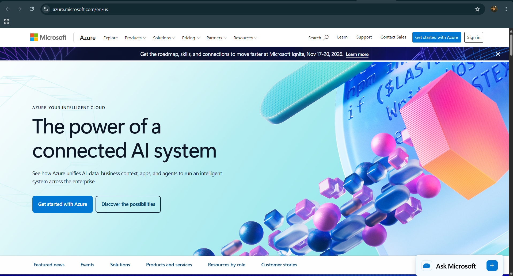

# Microsoft Azure Research

## Brief Overview

Microsoft Azure is a cloud computing platform developed and operated by Microsoft. It provides a wide range of cloud services for computing, storage, networking, databases, security, analytics, artificial intelligence, and application development.

Azure was officially launched on **February 1, 2010**. It was originally introduced as **Windows Azure** before being renamed **Microsoft Azure** in 2014. Microsoft owns and operates Azure as part of its cloud services business.

## Global Infrastructure

Microsoft Azure has a large global infrastructure designed to provide reliable, scalable, and low-latency cloud services to customers around the world. Azure has **70+ regions** and **400+ datacenters** globally, making it one of the largest cloud infrastructures in the world.

- **Regions:** 70+
- **Datacenters:** 400+
- **Availability Zones:** Available across many Azure regions

## Cloud Management Console

The **Azure Portal** is Microsoft's web-based management interface for Azure services and resources. It allows users to create, configure, monitor, and manage virtual machines, storage accounts, databases, networks, security settings, identities, and other cloud resources. Users can also monitor resource performance, manage subscriptions, view costs, and configure access permissions through the portal.

## Four (4) Core Services

1. **Virtual Machines** – Provides on-demand virtual computers that users can configure and use to run applications, websites, databases, and other workloads in the cloud.

2. **Blob Storage** – Azure Blob Storage is an object storage service designed for storing large amounts of unstructured data such as images, videos, documents, backups, and application files.

3. **Virtual Network** – Azure Virtual Network allows cloud resources to communicate securely with each other, the internet, and on-premises networks. It provides networking features such as private IP addresses, subnets, routing, and network security.

4. **Microsoft Entra ID (formerly Azure Active Directory)** – A cloud-based identity and access management service that helps organizations manage users, applications, devices, and access to resources securely.

## Three (3) Advantages

1. **Global Reach** – Azure provides cloud infrastructure in many regions around the world, allowing organizations to deploy applications closer to their customers and users.

2. **Scalability and Flexibility** – Azure allows organizations to easily scale computing, storage, networking, and other resources according to their workload and business requirements.

3. **Strong Enterprise Integration** – Azure integrates well with Microsoft products and technologies such as Windows Server, Microsoft 365, SQL Server, and Microsoft Entra ID, making it convenient for organizations already using the Microsoft ecosystem.

## Typical Enterprise Use Cases

- **Application and Web Hosting** – Enterprises use Azure Virtual Machines, App Services, and other cloud services to host business applications and websites.
- **Data Storage and Backup** – Organizations use Azure Storage to store files, application data, backups, and other large datasets securely.
- **Enterprise Identity and Security** – Businesses use Microsoft Entra ID to manage employee identities, authentication, and access to applications and cloud resources.

