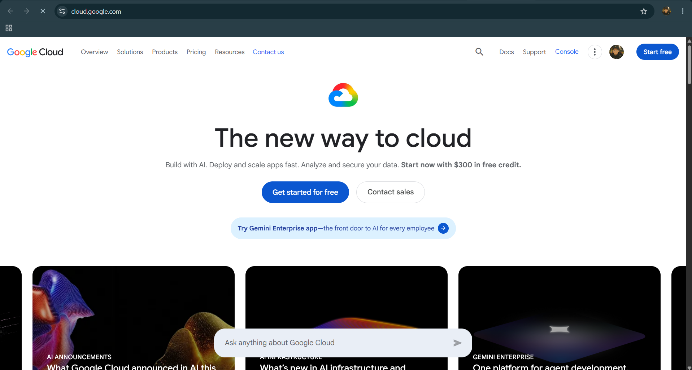

# Google Cloud Platform (GCP) Research

## Brief Overview

Google Cloud Platform (GCP), now commonly called **Google Cloud**, is a cloud computing platform developed and operated by Google. It provides a wide range of cloud services for computing, storage, databases, networking, artificial intelligence, machine learning, data analytics, and application development.

Google Cloud was officially launched in **2008**, when Google introduced its first cloud service, App Engine. It later expanded into a broad cloud computing platform. GCP is owned and operated by **Google LLC**, a subsidiary of Alphabet Inc.

## Global Infrastructure

Google Cloud operates a large global infrastructure consisting of multiple regions and zones. These locations allow organizations to deploy applications and store data closer to their users while improving availability and performance.

- **Regions:** 43+
- **Zones:** 130+
- **Global Network:** Google's private global network connects its cloud infrastructure around the world.

## Cloud Management Console

The **Google Cloud Console** is a web-based interface used to manage Google Cloud resources and services. It allows users to create, configure, monitor, and control resources such as virtual machines, storage buckets, databases, networks, security settings, and user permissions. It also provides tools for monitoring performance, managing projects, viewing costs, and accessing cloud services.

## Four (4) Core Services

1. **Compute Engine** – A scalable infrastructure service that provides virtual machines for running applications, websites, databases, and other workloads in Google's cloud.

2. **Cloud Storage** – An object storage service used to securely store and retrieve files and other types of unstructured data such as images, videos, documents, backups, and application data.

3. **VPC (Virtual Private Cloud)** – Provides networking capabilities that allow organizations to create and manage private networks for their cloud resources. It supports features such as subnets, IP addresses, routing, and firewall rules.

4. **Cloud IAM (Identity and Access Management)** – A service that controls who can access Google Cloud resources and what actions they are allowed to perform. It helps organizations manage permissions and secure their cloud environment.

## Three (3) Advantages

1. **High-Performance Global Network** – Google Cloud uses Google's global private network infrastructure to provide reliable and fast connectivity between users, applications, and cloud resources.

2. **Scalability and Flexibility** – GCP allows organizations to scale computing, storage, networking, and other resources according to their workload requirements.

3. **Strong Data and AI Capabilities** – Google Cloud provides powerful data analytics, artificial intelligence, and machine learning services that help businesses process large datasets and develop intelligent applications.

## Typical Enterprise Use Cases

- **Application and Website Hosting** – Enterprises use Compute Engine and other Google Cloud services to host scalable websites, APIs, and business applications.
- **Data Storage and Analytics** – Organizations use Cloud Storage and Google Cloud's data analytics services to store, process, and analyze large amounts of business data.
- **Artificial Intelligence and Machine Learning** – Businesses use Google Cloud AI and machine learning services to build applications such as predictive analytics, recommendation systems, and automated data processing.

